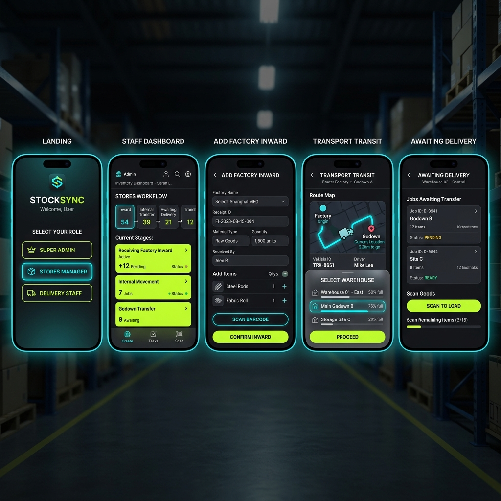

# Inventory Management System (Expo / React Native)

A modern, high-performance **Inventory Management System** built with **Expo**, **React Native**, and **TypeScript**. Designed with sleek dark/light mode aesthetics, glassmorphism, master-child carton barcode tracking, and multi-stage department workflows (Quality, Packaging Stage 1 & 2, Inventory Location, Transport, and Godown Delivery).

---

## 📱 Complete Multi-Screen Showcase



---

## ✨ Features

- **Staff Dashboard & Workflow Pipeline**:
  - **Quality Department Audit**: Batch inspection & status monitoring.
  - **Packaging Department Stage 1 & Stage 2**: Parent outer carton generation, child inner carton binding, and label printing.
  - **Inventory Location Management**:
    - **Add Factory (Inward)**: Log master cartons into factory inventory with auto-updating child item lineage.
    - **Transport**: Set transit details, select destination warehouses, driver & vehicle details, and dispatch items to transit.
    - **Delivery to Godown**: Track arriving cartons, select receiving godowns, and confirm batch receipts.
- **Warehouse Selection Bottom Sheet**: Glassmorphic bottom sheet location picker with MIDC & regional hub listings.
- **Simulated Barcode Scanner Modal**: Live camera viewfinder frame to simulate scanning master carton barcodes.
- **Theme Switching**: Dark Mode & Light Mode support.
- **Voice / Micro-interaction FAB**: `PulseFAB` voice assistant trigger.

---

## 🛠️ Technology Stack

- **Framework**: Expo (SDK 57) / React Native
- **Language**: TypeScript
- **Icons**: Lucide React Native (`lucide-react-native`)
- **Graphics**: React Native SVG (`react-native-svg`)
- **Storage**: `@react-native-async-storage/async-storage`

---

## 🚀 Getting Started

### 1. Install Dependencies

```bash
npm install
```

### 2. Start Expo Development Server

```bash
npm start
```

Press `w` to open in browser, `a` for Android emulator, or `i` for iOS simulator.

---

## 📦 Project Structure

```
InventryManagemetSystem/
├── assets/
│   ├── app_preview.png
│   └── full_app_screens_showcase.png
├── src/
│   ├── components/
│   │   ├── PulseFAB.tsx
│   │   ├── RoleActionCard.tsx
│   │   ├── SystemTabBar.tsx
│   │   └── ThemeToggle.tsx
│   ├── screens/
│   │   ├── AdminDashboardView.tsx
│   │   ├── DataManagementView.tsx
│   │   ├── GrinDashboardView.tsx
│   │   ├── GsnGrinFormsView.tsx
│   │   ├── InventoryItemManagementView.tsx
│   │   ├── InventoryLocationView.tsx
│   │   ├── LandingScreen.tsx
│   │   ├── PackagingStage1View.tsx
│   │   ├── PackagingStage2View.tsx
│   │   ├── QualityDepartmentView.tsx
│   │   ├── StaffDashboardView.tsx
│   │   ├── StaffStockView.tsx
│   │   └── UserManagementView.tsx
│   └── theme/
│       └── landingTheme.ts
├── App.tsx
├── app.json
├── package.json
└── tsconfig.json
```

---

## 📄 License

MIT License
